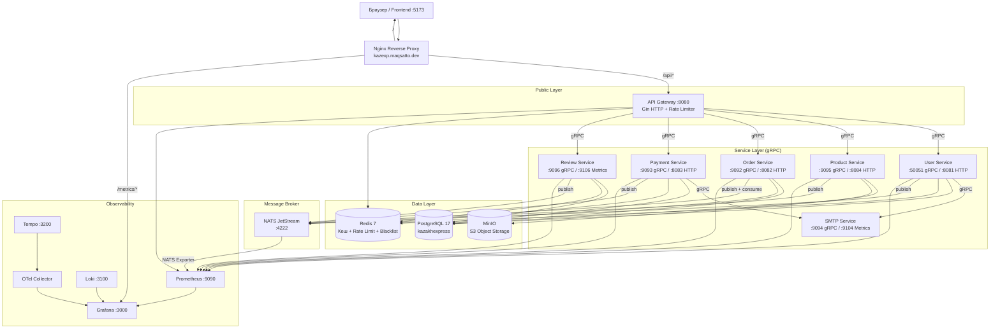
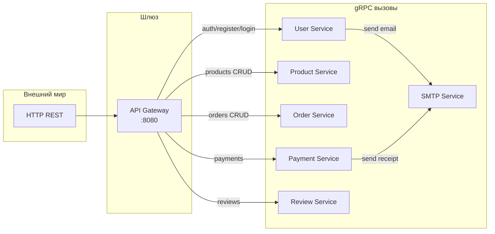
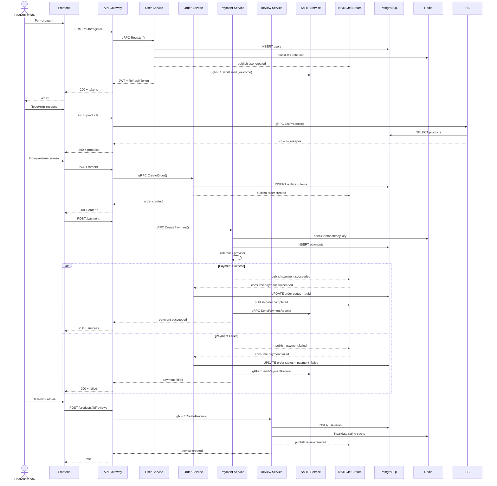
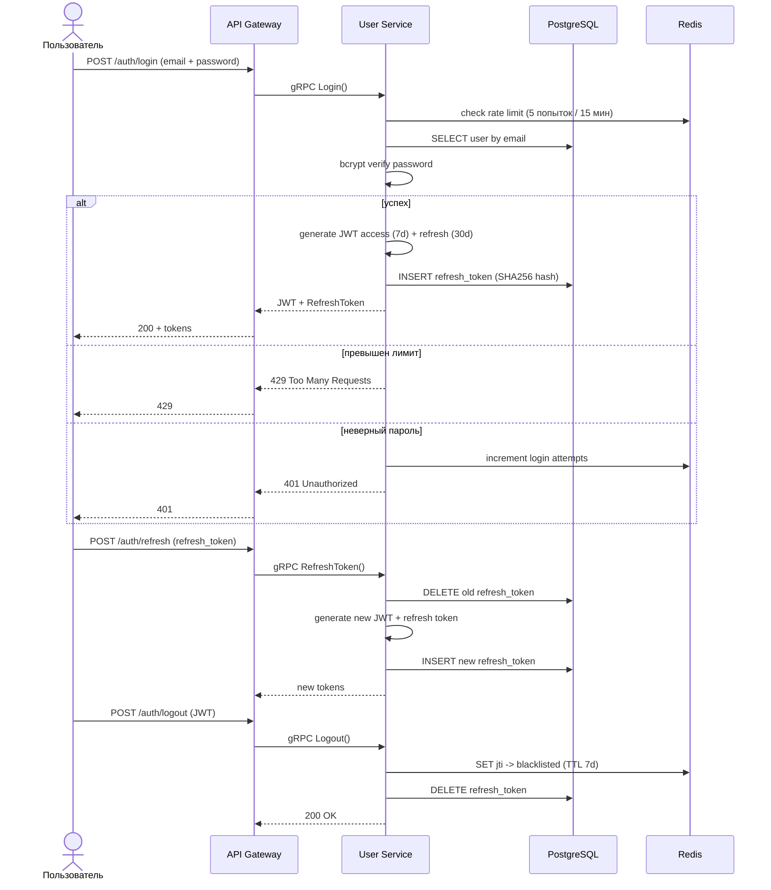
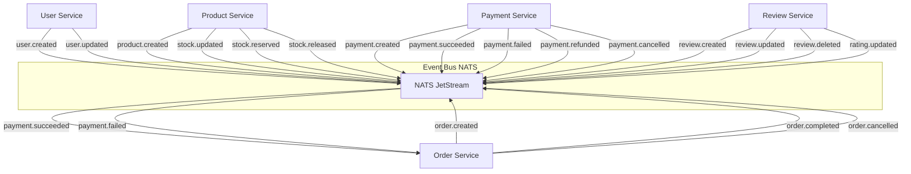
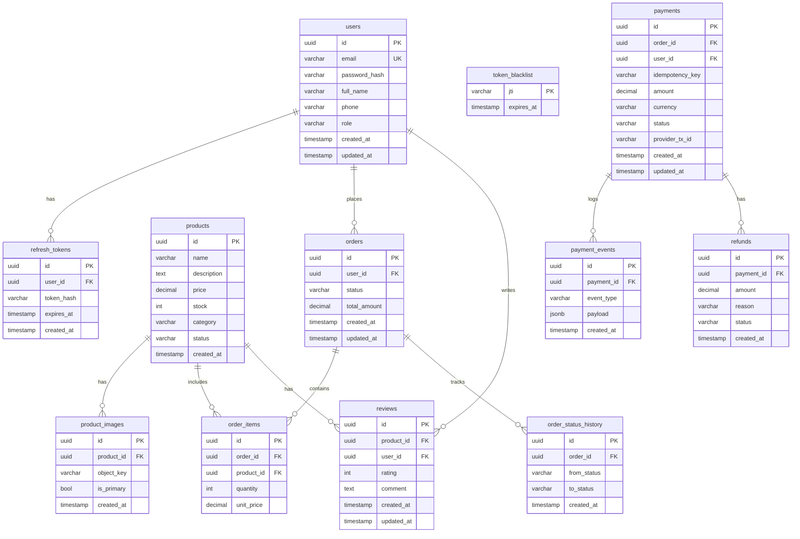
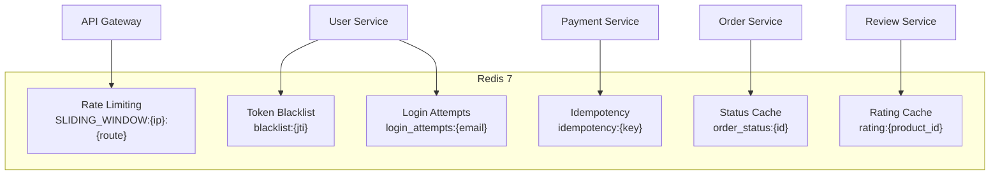
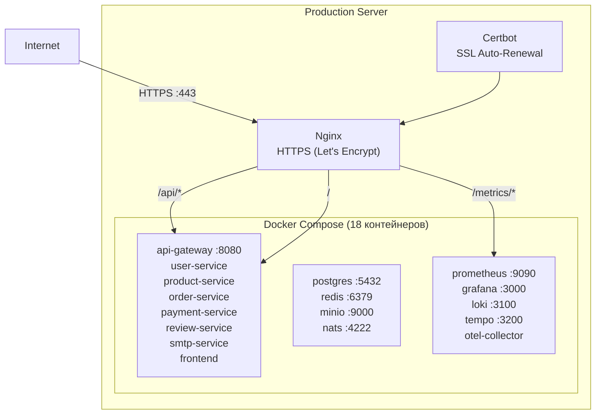

# Архитектура KazakhExpress

## Общая схема системы



## Коммуникация между сервисами



## Поток запроса (на примере оформления заказа)



## Аутентификация и JWT



## Топология NATS JetStream



## Схема базы данных PostgreSQL



## Использование Redis по сервисам



## Инфраструктура и деплой



## Технологический стек

| Компонент | Технология | Назначение |
|-----------|-----------|------------|
| **Язык** | Go 1.25 | Все микросервисы |
| **HTTP Framework** | Gin | API Gateway и HTTP endpoints |
| **API Gateway** | Custom Go/Gin | Единая публичная точка входа |
| **Service Mesh** | gRPC | Внутренняя коммуникация сервисов |
| **Event Bus** | NATS 2.11 + JetStream | Асинхронные события |
| **База данных** | PostgreSQL 17 | Персистентное хранилище |
| **Кеш** | Redis 7 | Rate limiting, blacklist, idempotency, кеш |
| **Объектное хранилище** | MinIO (S3) | Изображения товаров |
| **Email** | Resend API + SMTP fallback | Отправка писем |
| **Аутентификация** | JWT (HS256) + bcrypt + Refresh Tokens | Auth |
| **Observability** | Prometheus + Grafana + Loki + Tempo + OTel | Мониторинг, логи, трейсинг |
| **Фронтенд** | React 19 + TypeScript + Vite | UI marketplace |
| **CI/CD** | GitHub Actions (4 workflows) | Линтинг, тесты, proto generation |
| **Деплой** | Docker Compose + Nginx + Let's Encrypt | Продакшн |
| **API Spec** | OpenAPI 3.0.3 | Документация API |

## Структура репозитория

```
KazakhExpress/
├── api-gateway/          # Единый HTTP шлюз (Gin)
│   └── internal/
│       ├── gateway/          # Router, rate limiter (Redis)
│       ├── orderservice/     # gRPC client для Order Service
│       ├── paymentservice/   # gRPC client для Payment Service
│       ├── productservice/   # gRPC client для Product Service
│       ├── reviewservice/    # gRPC client для Review Service
│       └── userservice/      # gRPC client для User Service
├── user-service/         # Аутентификация, профили, JWT
│   └── internal/
│       ├── email/            # gRPC client -> smtp-service
│       ├── grpc/             # gRPC server
│       ├── http/             # HTTP handler
│       ├── messaging/        # NATS publisher
│       ├── redis/            # Redis client
│       └── user/             # Бизнес-логика
├── product-service/      # Товары, сток, изображения
│   └── internal/
│       ├── grpcapi/          # gRPC server
│       ├── http/             # HTTP handler
│       ├── messaging/        # NATS publisher
│       ├── product/          # Бизнес-логика
│       └── storage/          # MinIO client
├── order-service/        # Заказы, статусы
│   └── internal/
│       ├── cache/            # Redis status cache
│       ├── grpcapi/          # gRPC server
│       ├── http/             # HTTP handler
│       ├── messaging/        # NATS publisher + consumer
│       └── order/            # Бизнес-логика
├── payment-service/      # Платежи, idempotency, refunds
│   └── internal/
│       ├── cache/            # Redis idempotency store
│       ├── email/            # gRPC client -> smtp-service
│       ├── grpcapi/          # gRPC server
│       ├── http/             # HTTP handler
│       ├── messaging/        # NATS publisher
│       ├── payment/          # Бизнес-логика
│       └── provider/         # Mock payment provider
├── review-service/       # Отзывы, рейтинг
│   └── internal/
│       ├── cache/            # Redis rating cache
│       ├── grpcapi/          # gRPC server
│       ├── messaging/        # NATS publisher
│       └── review/           # Бизнес-логика
├── smtp-service/         # Отправка email (Resend + SMTP fallback)
│   └── internal/
│       ├── grpcapi/          # gRPC server
│       ├── smtp/             # SMTP sender
│       └── smtpapp/          # Wiring
├── frontend/             # React + TypeScript (Vite)
├── infra/                # Observability конфиги
│   ├── grafana/              # Dashboard JSON + provisioning
│   ├── prometheus/           # prometheus.yml
│   ├── loki/                 # loki.yml
│   ├── tempo/                # tempo.yml
│   └── otel-collector/       # config.yml
├── deploy/               # Продакшн деплой
│   ├── nginx/                # kazexp.maqsatto.dev.conf
│   └── setup-ubuntu.sh       # автоматический деплой
├── scripts/              # Тесты и demo скрипты
└── docs/                 # Документация
```

## Ключевые особенности архитектуры

1. **Единая точка входа** — API Gateway обрабатывает все внешние запросы, внутренние сервисы не暴露 наружу
2. **gRPC communication** — быстрая бинарная сериализация между сервисами
3. **Асинхронные события через NATS** — слабая связанность сервисов
4. **Graceful degradation** — при недоступности NATS/Redis сервисы продолжают работу
5. **Idempotency платежей** — Redis предотвращает дублирование платежей
6. **Rate limiting в 2 слоях** — на уровне Gateway и User Service (login)
7. **Полный observability stack** — Prometheus метрики, Loki логи, Tempo трейсинг, Grafana дашборды
